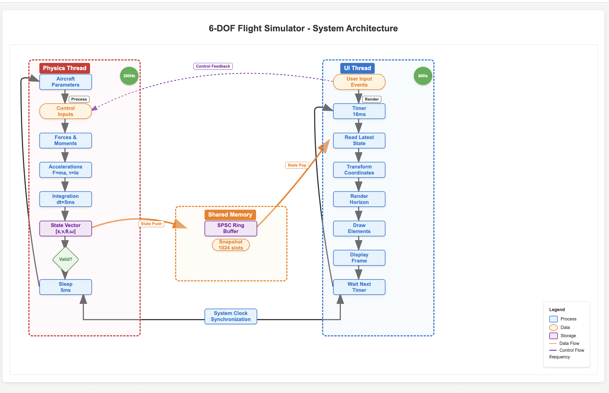

# 6-DOF Flight Dynamics Simulator 
## Intro

> **The 6-DOF Flight Dynamics Simulator** is a simulation designed to model and visualize the complete motion of an aircraft in three-dimensional space. By capturing all **six degrees of freedom**—three translational (**surge**: forward/back, **sway**: left/right, **heave**: up/down) and three rotational (**roll**: tilt about nose-to-tail axis, **pitch**: nose up/down, **yaw**: nose left/right)—the simulator provides an accurate picture of flight dynamics.

The simulator emphasizes deterministic timing and real-time performance: the physics engine runs at 200Hz to capture rapid dynamic changes, while the user interface operates at 60Hz

This document below describes the system architecture

## Architecture Diagram

*Figure 1: Complete system architecture showing the multi-threaded design with physics simulation (200Hz), shared memory layer, and UI rendering (60Hz)*

## Key Design Principles

- **Real-time Performance**: Physics simulation runs at 200Hz for accuracy, UI renders at 60Hz for smooth display
- **Deterministic Timing**: Fixed timestep integration ensures simulation consistency

## Architecture Overview

The system consists of three main components:

1. **Physics Thread** (200Hz) - High-frequency simulation engine
2. **Shared Memory Layer** - Lock-free inter-thread communication
3. **UI Thread** (60Hz) - User interface and rendering system

## Component Details

#### Flow Sequence:
1. **Aircraft Parameters** - Load aircraft configuration (mass, inertia, aerodynamic coefficients)
2. **Control Inputs** - Read pilot commands (stick, rudder, throttle)
3. **Forces & Moments** - Calculate aerodynamic and propulsive forces using flight dynamics equations
4. **Accelerations** - Apply Newton's laws (F=ma, τ=Iα) to determine linear and angular accelerations
5. **Integration** - Numerical integration of accelerations to update velocities and positions
6. **State Vector** - Store complete aircraft state [position, velocity, attitude, angular rates]
7. **Validation** - Ensure physical constraints and detect simulation errors
8. **Sleep** - Maintain precise 5ms timing cycle

### Shared Memory Layer

The shared memory system provides efficient, thread-safe communication between physics and UI threads without blocking operations.

#### Components:
- **SPSC Ring Buffer**: Lock-free circular buffer with 1024 state snapshots
- **State Snapshots**: Complete aircraft state copies with timestamps

### UI Thread (60Hz)

The UI thread handles user interaction and visual rendering at standard display refresh rates (60Hz/16ms).
#### Flow Sequence:
1. **User Input Events** - Process keyboard, mouse, and controller inputs
2. **Timer** - 16ms frame timing for smooth 60Hz operation
3. **Read Latest State** - Fetch most recent aircraft state from ring buffer
4. **Transform Coordinates** - Convert simulation coordinates to display coordinates
5. **Render Horizon** - Draw artificial horizon and attitude indicators
6. **Draw Elements** - Render instruments, HUD elements, and cockpit displays
7. **Display Frame** - Present completed frame to screen
8. **Wait Next Timer** - Synchronize to maintain consistent frame rate

## Timing and Synchronization

### System Clock Synchronization
- Both threads synchronized to system high-resolution timer
- Physics thread: 5ms intervals (200Hz)
- UI thread: 16ms intervals (60Hz)
